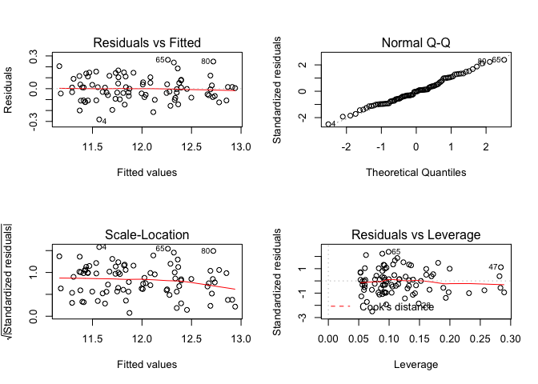
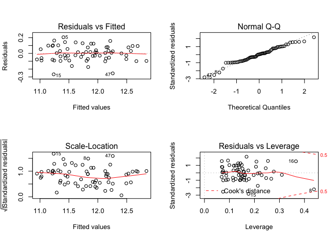
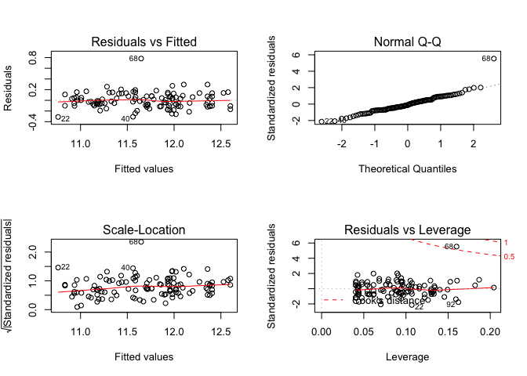
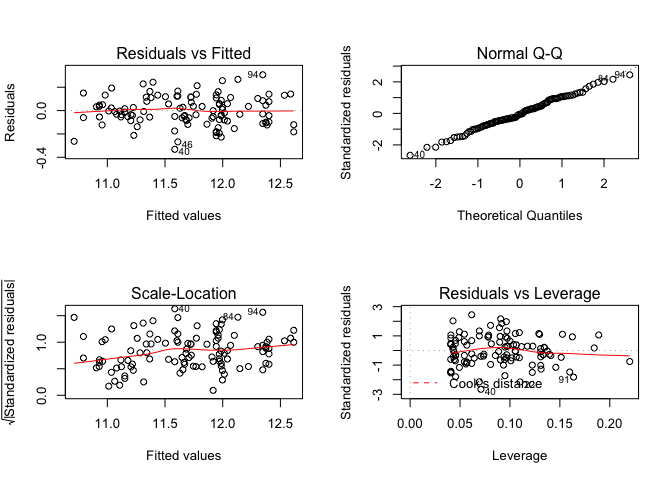
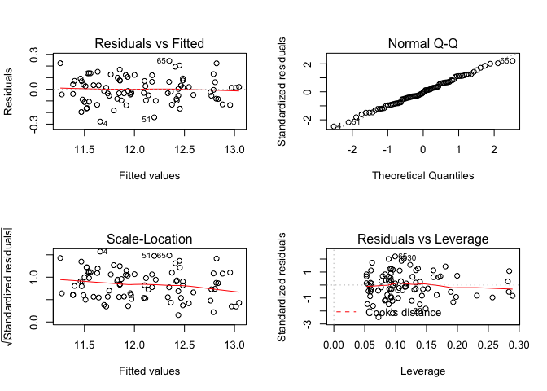
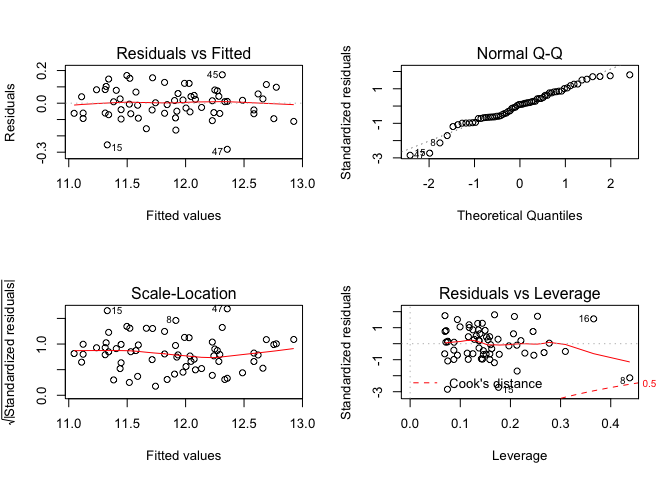
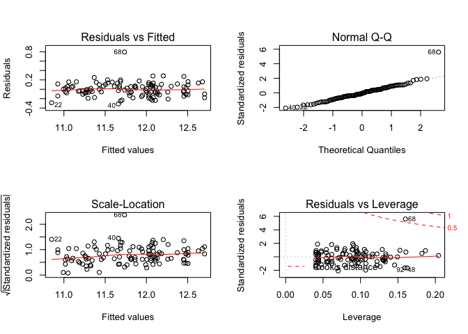

data exploration
================

``` r
lawsuit = 
read_csv("data/Lawsuit.csv") %>% 
   janitor::clean_names() %>% 
  mutate(dept = factor(dept,levels = c(1:6),
                       labels =
                    c("Biochemistry","Physiology","Genetics",
                      "Pediatrics","Medicine","Surgery")),
         gender = factor(gender,levels = c(0:1),
                       labels =
                    c("Female","Male")),
         clin = factor(clin,levels = c(0:1),
                       labels =
                    c("Research","Clinical")),
         cert = factor(cert,levels = c(0:1),
                       labels =
                    c("Not certified","Broad certified")),
         rank = factor(rank,levels = c(1:3),
                       labels =
                    c("Assistant","Associate","Full professor")))
```

    ## Parsed with column specification:
    ## cols(
    ##   ID = col_double(),
    ##   Dept = col_double(),
    ##   Gender = col_double(),
    ##   Clin = col_double(),
    ##   Cert = col_double(),
    ##   Prate = col_double(),
    ##   Exper = col_double(),
    ##   Rank = col_double(),
    ##   Sal94 = col_double(),
    ##   Sal95 = col_double()
    ## )

Summarize all variables by gender

``` r
 sum_data  <-  arsenal::tableby( gender ~ dept + clin + cert + 
                                 prate + exper + rank + sal94   +
                                 sal95, 
                                data  = lawsuit,
                                test  = FALSE, 
                                total = FALSE,
                                numeric.stats =
                                  c("meansd","medianq1q3","range"))
summ = summary(sum_data,text = TRUE)
summ %>% 
  knitr::kable(format = "html")
```

<table>

<thead>

<tr>

<th style="text-align:left;">

</th>

<th style="text-align:left;">

Female (N=106)

</th>

<th style="text-align:left;">

Male (N=155)

</th>

</tr>

</thead>

<tbody>

<tr>

<td style="text-align:left;">

dept

</td>

<td style="text-align:left;">

</td>

<td style="text-align:left;">

</td>

</tr>

<tr>

<td style="text-align:left;">

  - Biochemistry
    </td>
    <td style="text-align:left;">
    20 (18.9%)
    </td>
    <td style="text-align:left;">
    30 (19.4%)
    </td>
    </tr>
    <tr>
    <td style="text-align:left;">
      - Physiology
        </td>
        <td style="text-align:left;">
        20 (18.9%)
        </td>
        <td style="text-align:left;">
        20 (12.9%)
        </td>
        </tr>
        <tr>
        <td style="text-align:left;">
          - Genetics
            </td>
            <td style="text-align:left;">
            11 (10.4%)
            </td>
            <td style="text-align:left;">
            10 (6.5%)
            </td>
            </tr>
            <tr>
            <td style="text-align:left;">
              - Pediatrics
                </td>
                <td style="text-align:left;">
                20 (18.9%)
                </td>
                <td style="text-align:left;">
                10 (6.5%)
                </td>
                </tr>
                <tr>
                <td style="text-align:left;">
                  - Medicine
                    </td>
                    <td style="text-align:left;">
                    30 (28.3%)
                    </td>
                    <td style="text-align:left;">
                    50 (32.3%)
                    </td>
                    </tr>
                    <tr>
                    <td style="text-align:left;">
                      - Surgery
                        </td>
                        <td style="text-align:left;">
                        5 (4.7%)
                        </td>
                        <td style="text-align:left;">
                        35 (22.6%)
                        </td>
                        </tr>
                        <tr>
                        <td style="text-align:left;">
                        clin
                        </td>
                        <td style="text-align:left;">
                        </td>
                        <td style="text-align:left;">
                        </td>
                        </tr>
                        <tr>
                        <td style="text-align:left;">
                          - Research
                            </td>
                            <td style="text-align:left;">
                            46 (43.4%)
                            </td>
                            <td style="text-align:left;">
                            55 (35.5%)
                            </td>
                            </tr>
                            <tr>
                            <td style="text-align:left;">
                              - Clinical
                                </td>
                                <td style="text-align:left;">
                                60 (56.6%)
                                </td>
                                <td style="text-align:left;">
                                100 (64.5%)
                                </td>
                                </tr>
                                <tr>
                                <td style="text-align:left;">
                                cert
                                </td>
                                <td style="text-align:left;">
                                </td>
                                <td style="text-align:left;">
                                </td>
                                </tr>
                                <tr>
                                <td style="text-align:left;">
                                  - Not certified
                                    </td>
                                    <td style="text-align:left;">
                                    36 (34.0%)
                                    </td>
                                    <td style="text-align:left;">
                                    37 (23.9%)
                                    </td>
                                    </tr>
                                    <tr>
                                    <td style="text-align:left;">
                                      - Broad certified
                                        </td>
                                        <td style="text-align:left;">
                                        70 (66.0%)
                                        </td>
                                        <td style="text-align:left;">
                                        118 (76.1%)
                                        </td>
                                        </tr>
                                        <tr>
                                        <td style="text-align:left;">
                                        prate
                                        </td>
                                        <td style="text-align:left;">
                                        </td>
                                        <td style="text-align:left;">
                                        </td>
                                        </tr>
                                        <tr>
                                        <td style="text-align:left;">
                                          - Mean
                                            (SD)
                                            </td>
                                            <td style="text-align:left;">
                                            5.350
                                            (1.886)
                                            </td>
                                            <td style="text-align:left;">
                                            4.646
                                            (1.938)
                                            </td>
                                            </tr>
                                            <tr>
                                            <td style="text-align:left;">
                                              - Median (Q1,
                                                Q3)
                                                </td>
                                                <td style="text-align:left;">
                                                5.250 (3.725,
                                                7.275)
                                                </td>
                                                <td style="text-align:left;">
                                                4.000 (3.100,
                                                6.700)
                                                </td>
                                                </tr>
                                                <tr>
                                                <td style="text-align:left;">
                                                  - Range
                                                    </td>
                                                    <td style="text-align:left;">
                                                    2.400 -
                                                    8.700
                                                    </td>
                                                    <td style="text-align:left;">
                                                    1.300 -
                                                    8.600
                                                    </td>
                                                    </tr>
                                                    <tr>
                                                    <td style="text-align:left;">
                                                    exper
                                                    </td>
                                                    <td style="text-align:left;">
                                                    </td>
                                                    <td style="text-align:left;">
                                                    </td>
                                                    </tr>
                                                    <tr>
                                                    <td style="text-align:left;">
                                                      - Mean
                                                        (SD)
                                                        </td>
                                                        <td style="text-align:left;">
                                                        7.491
                                                        (4.166)
                                                        </td>
                                                        <td style="text-align:left;">
                                                        12.103
                                                        (6.704)
                                                        </td>
                                                        </tr>
                                                        <tr>
                                                        <td style="text-align:left;">
                                                          - Median (Q1,
                                                            Q3)
                                                            </td>
                                                            <td style="text-align:left;">
                                                            7.000
                                                            (5.000,
                                                            10.000)
                                                            </td>
                                                            <td style="text-align:left;">
                                                            10.000
                                                            (7.000,
                                                            15.000)
                                                            </td>
                                                            </tr>
                                                            <tr>
                                                            <td style="text-align:left;">
                                                              - Range
                                                                </td>
                                                                <td style="text-align:left;">
                                                                1.000 -
                                                                23.000
                                                                </td>
                                                                <td style="text-align:left;">
                                                                2.000 -
                                                                37.000
                                                                </td>
                                                                </tr>
                                                                <tr>
                                                                <td style="text-align:left;">
                                                                rank
                                                                </td>
                                                                <td style="text-align:left;">
                                                                </td>
                                                                <td style="text-align:left;">
                                                                </td>
                                                                </tr>
                                                                <tr>
                                                                <td style="text-align:left;">
                                                                  - Assistant
                                                                    </td>
                                                                    <td style="text-align:left;">
                                                                    69
                                                                    (65.1%)
                                                                    </td>
                                                                    <td style="text-align:left;">
                                                                    43
                                                                    (27.7%)
                                                                    </td>
                                                                    </tr>
                                                                    <tr>
                                                                    <td style="text-align:left;">
                                                                      - Associate
                                                                        </td>
                                                                        <td style="text-align:left;">
                                                                        21
                                                                        (19.8%)
                                                                        </td>
                                                                        <td style="text-align:left;">
                                                                        43
                                                                        (27.7%)
                                                                        </td>
                                                                        </tr>
                                                                        <tr>
                                                                        <td style="text-align:left;">
                                                                          - Full
                                                                            professor
                                                                            </td>
                                                                            <td style="text-align:left;">
                                                                            16
                                                                            (15.1%)
                                                                            </td>
                                                                            <td style="text-align:left;">
                                                                            69
                                                                            (44.5%)
                                                                            </td>
                                                                            </tr>
                                                                            <tr>
                                                                            <td style="text-align:left;">
                                                                            sal94
                                                                            </td>
                                                                            <td style="text-align:left;">
                                                                            </td>
                                                                            <td style="text-align:left;">
                                                                            </td>
                                                                            </tr>
                                                                            <tr>
                                                                            <td style="text-align:left;">
                                                                              - Mean
                                                                                (SD)
                                                                                </td>
                                                                                <td style="text-align:left;">
                                                                                118871.274
                                                                                (56168.006)
                                                                                </td>
                                                                                <td style="text-align:left;">
                                                                                177338.761
                                                                                (85930.540)
                                                                                </td>
                                                                                </tr>
                                                                                <tr>
                                                                                <td style="text-align:left;">
                                                                                  - Median
                                                                                    (Q1,
                                                                                    Q3)
                                                                                    </td>
                                                                                    <td style="text-align:left;">
                                                                                    108457.000
                                                                                    (75774.500,
                                                                                    143096.000)
                                                                                    </td>
                                                                                    <td style="text-align:left;">
                                                                                    155006.000
                                                                                    (109687.000,
                                                                                    231501.500)
                                                                                    </td>
                                                                                    </tr>
                                                                                    <tr>
                                                                                    <td style="text-align:left;">
                                                                                      - Range
                                                                                        </td>
                                                                                        <td style="text-align:left;">
                                                                                        34514.000
                                                                                        -
                                                                                        308081.000
                                                                                        </td>
                                                                                        <td style="text-align:left;">
                                                                                        52582.000
                                                                                        -
                                                                                        428876.000
                                                                                        </td>
                                                                                        </tr>
                                                                                        <tr>
                                                                                        <td style="text-align:left;">
                                                                                        sal95
                                                                                        </td>
                                                                                        <td style="text-align:left;">
                                                                                        </td>
                                                                                        <td style="text-align:left;">
                                                                                        </td>
                                                                                        </tr>
                                                                                        <tr>
                                                                                        <td style="text-align:left;">
                                                                                          - Mean
                                                                                            (SD)
                                                                                            </td>
                                                                                            <td style="text-align:left;">
                                                                                            130876.915
                                                                                            (62034.507)
                                                                                            </td>
                                                                                            <td style="text-align:left;">
                                                                                            194914.090
                                                                                            (94902.728)
                                                                                            </td>
                                                                                            </tr>
                                                                                            <tr>
                                                                                            <td style="text-align:left;">
                                                                                              - Median
                                                                                                (Q1,
                                                                                                Q3)
                                                                                                </td>
                                                                                                <td style="text-align:left;">
                                                                                                119135.000
                                                                                                (82345.250,
                                                                                                154170.500)
                                                                                                </td>
                                                                                                <td style="text-align:left;">
                                                                                                170967.000
                                                                                                (119952.500,
                                                                                                257163.000)
                                                                                                </td>
                                                                                                </tr>
                                                                                                <tr>
                                                                                                <td style="text-align:left;">
                                                                                                  - Range
                                                                                                    </td>
                                                                                                    <td style="text-align:left;">
                                                                                                    38675.000
                                                                                                    -
                                                                                                    339664.000
                                                                                                    </td>
                                                                                                    <td style="text-align:left;">
                                                                                                    58923.000
                                                                                                    -
                                                                                                    472589.000
                                                                                                    </td>
                                                                                                    </tr>
                                                                                                    </tbody>
                                                                                                    </table>

Distributions

``` r
gg_94 = 
lawsuit %>% 
 ggplot(aes(sal94,..density..))+
 geom_histogram()+
 geom_line(stat = 'density',size = 1)+
    labs(x = "sal94")

gg_95 = 
lawsuit %>% 
 ggplot(aes(sal95,..density..))+
 geom_histogram()+
 geom_line(stat = 'density',size = 1)+
    labs(x = "sal95")

gg_94 + gg_95
```

    ## `stat_bin()` using `bins = 30`. Pick better value with `binwidth`.
    ## `stat_bin()` using `bins = 30`. Pick better value with `binwidth`.

<!-- -->

Possible transformation

``` r
lawsuit_log = 
lawsuit %>% 
  mutate(log_sal94 = log(sal94),
         log_sal95 = log(sal95)) %>% 
  dplyr::select(-sal94,-sal95)

gg_94 = 
lawsuit_log %>% 
 ggplot(aes(log_sal94,..density..))+
 geom_histogram()+
 geom_line(stat = 'density',size = 1)+
    labs(x = "log_sal94")

gg_95 = 
lawsuit_log %>% 
 ggplot(aes(log_sal95,..density..))+
 geom_histogram()+
 geom_line(stat = 'density',size = 1)+
    labs(x = "log_sal95")

gg_94 + gg_95
```

    ## `stat_bin()` using `bins = 30`. Pick better value with `binwidth`.
    ## `stat_bin()` using `bins = 30`. Pick better value with `binwidth`.

<!-- -->

# Confounders for 94

``` r
lawsuit_log_94 =
lawsuit_log %>% 
    dplyr::select(-log_sal95,-id)


con = lm(log_sal94 ~ gender, data = lawsuit_log_94) %>% summary()
con_1 = lm(log_sal94 ~ gender + dept, data = lawsuit_log_94) %>% summary()
con_2 = lm(log_sal94 ~ gender + clin, data = lawsuit_log_94) %>% summary()
con_3 = lm(log_sal94 ~ gender + cert, data = lawsuit_log_94) %>% summary()
con_4 = lm(log_sal94 ~ gender + prate, data = lawsuit_log_94) %>% summary()
con_5 = lm(log_sal94 ~ gender + exper, data = lawsuit_log_94) %>% summary()
con_6 = lm(log_sal94 ~ gender + rank, data = lawsuit_log_94) %>% summary()

con_tab_94 = tibble("variables" = c("gender", "gender + dept", "gender + clin", "gender + cert", "gender + prate", "gender + exper", "gender + rank"), "coef" = c(con$coefficients[2],con_1$coefficients[2],con_2$coefficients[2],con_3$coefficients[2],con_4$coefficients[2],con_5$coefficients[2],con_6$coefficients[2]))

con_tab_94 %>% mutate(
  diff = abs((coef[1]-coef)/coef[1]),
  confounder = ifelse(diff>=0.1, "Y", "N")
)
```

    ## # A tibble: 7 x 4
    ##   variables       coef   diff confounder
    ##   <chr>          <dbl>  <dbl> <chr>     
    ## 1 gender         0.386 0      N         
    ## 2 gender + dept  0.206 0.466  Y         
    ## 3 gender + clin  0.338 0.124  Y         
    ## 4 gender + cert  0.334 0.136  Y         
    ## 5 gender + prate 0.253 0.344  Y         
    ## 6 gender + exper 0.309 0.201  Y         
    ## 7 gender + rank  0.351 0.0922 N

``` r
con_tab_94
```

    ## # A tibble: 7 x 2
    ##   variables       coef
    ##   <chr>          <dbl>
    ## 1 gender         0.386
    ## 2 gender + dept  0.206
    ## 3 gender + clin  0.338
    ## 4 gender + cert  0.334
    ## 5 gender + prate 0.253
    ## 6 gender + exper 0.309
    ## 7 gender + rank  0.351

``` r
(0.2251-0.2024)/0.2251
```

    ## [1] 0.1008441

``` r
# Except for rank, all covariates are confounders
```

# 94 salary

``` r
mul.fit <- lm(log_sal94 ~ .,lawsuit_log_94)
summary(mul.fit)
```

    ## 
    ## Call:
    ## lm(formula = log_sal94 ~ ., data = lawsuit_log_94)
    ## 
    ## Residuals:
    ##      Min       1Q   Median       3Q      Max 
    ## -0.34833 -0.07668 -0.01446  0.08196  0.89241 
    ## 
    ## Coefficients:
    ##                     Estimate Std. Error t value Pr(>|t|)    
    ## (Intercept)         11.09660    0.13506  82.161  < 2e-16 ***
    ## deptPhysiology      -0.17620    0.02916  -6.043 5.50e-09 ***
    ## deptGenetics         0.17021    0.03888   4.378 1.77e-05 ***
    ## deptPediatrics       0.14848    0.05375   2.762 0.006169 ** 
    ## deptMedicine         0.49591    0.04539  10.927  < 2e-16 ***
    ## deptSurgery          0.86754    0.06177  14.043  < 2e-16 ***
    ## genderMale           0.02089    0.02027   1.030 0.303817    
    ## clinClinical         0.16065    0.04124   3.896 0.000126 ***
    ## certBroad certified  0.19306    0.02129   9.070  < 2e-16 ***
    ## prate               -0.02207    0.01741  -1.268 0.205970    
    ## exper                0.01798    0.00183   9.828  < 2e-16 ***
    ## rankAssociate        0.13105    0.02365   5.542 7.63e-08 ***
    ## rankFull professor   0.21854    0.02637   8.286 7.39e-15 ***
    ## ---
    ## Signif. codes:  0 '***' 0.001 '**' 0.01 '*' 0.05 '.' 0.1 ' ' 1
    ## 
    ## Residual standard error: 0.1338 on 248 degrees of freedom
    ## Multiple R-squared:  0.9339, Adjusted R-squared:  0.9307 
    ## F-statistic: 291.8 on 12 and 248 DF,  p-value: < 2.2e-16

``` r
# let gender be a stratified factor

mul.fit_all_gender <- lm(log_sal94 ~ . + 
              gender*rank + gender*clin + gender*cert +
              gender*prate + gender*rank + gender*dept
              ,lawsuit_log_94)
summary(mul.fit_all_gender)
```

    ## 
    ## Call:
    ## lm(formula = log_sal94 ~ . + gender * rank + gender * clin + 
    ##     gender * cert + gender * prate + gender * rank + gender * 
    ##     dept, data = lawsuit_log_94)
    ## 
    ## Residuals:
    ##      Min       1Q   Median       3Q      Max 
    ## -0.32796 -0.07531 -0.00973  0.07473  0.83334 
    ## 
    ## Coefficients:
    ##                                 Estimate Std. Error t value Pr(>|t|)    
    ## (Intercept)                    11.174223   0.211986  52.712  < 2e-16 ***
    ## deptPhysiology                 -0.225620   0.043226  -5.220 3.91e-07 ***
    ## deptGenetics                    0.119925   0.053508   2.241   0.0259 *  
    ## deptPediatrics                  0.093752   0.080266   1.168   0.2440    
    ## deptMedicine                    0.450671   0.072220   6.240 1.98e-09 ***
    ## deptSurgery                     0.789225   0.108898   7.247 5.90e-12 ***
    ## genderMale                     -0.113831   0.274489  -0.415   0.6787    
    ## clinClinical                    0.153738   0.065979   2.330   0.0206 *  
    ## certBroad certified             0.199339   0.033382   5.972 8.49e-09 ***
    ## prate                          -0.032653   0.027258  -1.198   0.2321    
    ## exper                           0.018432   0.001866   9.878  < 2e-16 ***
    ## rankAssociate                   0.170436   0.034717   4.909 1.70e-06 ***
    ## rankFull professor              0.277928   0.040950   6.787 9.02e-11 ***
    ## genderMale:rankAssociate       -0.089624   0.045829  -1.956   0.0517 .  
    ## genderMale:rankFull professor  -0.110862   0.047795  -2.320   0.0212 *  
    ## genderMale:clinClinical        -0.012387   0.085252  -0.145   0.8846    
    ## genderMale:certBroad certified -0.008180   0.044238  -0.185   0.8535    
    ## genderMale:prate                0.022328   0.035675   0.626   0.5320    
    ## deptPhysiology:genderMale       0.093838   0.058389   1.607   0.1094    
    ## deptGenetics:genderMale         0.116229   0.079833   1.456   0.1467    
    ## deptPediatrics:genderMale       0.116622   0.111545   1.046   0.2968    
    ## deptMedicine:genderMale         0.100604   0.094623   1.063   0.2888    
    ## deptSurgery:genderMale          0.149184   0.136682   1.091   0.2762    
    ## ---
    ## Signif. codes:  0 '***' 0.001 '**' 0.01 '*' 0.05 '.' 0.1 ' ' 1
    ## 
    ## Residual standard error: 0.1334 on 238 degrees of freedom
    ## Multiple R-squared:  0.9369, Adjusted R-squared:  0.9311 
    ## F-statistic: 160.6 on 22 and 238 DF,  p-value: < 2.2e-16

``` r
# only gender*rank is significant
mul.fit_fixed_gender <- lm(log_sal94 ~ . + gender*rank, lawsuit_log_94)
summary(mul.fit_fixed_gender)
```

    ## 
    ## Call:
    ## lm(formula = log_sal94 ~ . + gender * rank, data = lawsuit_log_94)
    ## 
    ## Residuals:
    ##      Min       1Q   Median       3Q      Max 
    ## -0.33296 -0.08351 -0.01394  0.08565  0.85417 
    ## 
    ## Coefficients:
    ##                                Estimate Std. Error t value Pr(>|t|)    
    ## (Intercept)                   11.086860   0.133855  82.827  < 2e-16 ***
    ## deptPhysiology                -0.175982   0.028881  -6.093 4.24e-09 ***
    ## deptGenetics                   0.168092   0.038533   4.362 1.89e-05 ***
    ## deptPediatrics                 0.151496   0.053322   2.841 0.004872 ** 
    ## deptMedicine                   0.497990   0.045023  11.061  < 2e-16 ***
    ## deptSurgery                    0.862242   0.061257  14.076  < 2e-16 ***
    ## genderMale                     0.070659   0.027953   2.528 0.012105 *  
    ## clinClinical                   0.147083   0.041200   3.570 0.000429 ***
    ## certBroad certified            0.194755   0.021390   9.105  < 2e-16 ***
    ## prate                         -0.023014   0.017247  -1.334 0.183307    
    ## exper                          0.018453   0.001822  10.126  < 2e-16 ***
    ## rankAssociate                  0.169818   0.033953   5.002 1.08e-06 ***
    ## rankFull professor             0.280968   0.039637   7.088 1.43e-11 ***
    ## genderMale:rankAssociate      -0.084204   0.044766  -1.881 0.061155 .  
    ## genderMale:rankFull professor -0.109202   0.046682  -2.339 0.020122 *  
    ## ---
    ## Signif. codes:  0 '***' 0.001 '**' 0.01 '*' 0.05 '.' 0.1 ' ' 1
    ## 
    ## Residual standard error: 0.1326 on 246 degrees of freedom
    ## Multiple R-squared:  0.9356, Adjusted R-squared:  0.932 
    ## F-statistic: 255.3 on 14 and 246 DF,  p-value: < 2.2e-16

``` r
# remove non-significant variable: prate
# test model with and without prate
mul.fit_no_prate <- update(mul.fit_fixed_gender, . ~ . -prate)
summary(mul.fit_no_prate)
```

    ## 
    ## Call:
    ## lm(formula = log_sal94 ~ dept + gender + clin + cert + exper + 
    ##     rank + gender:rank, data = lawsuit_log_94)
    ## 
    ## Residuals:
    ##      Min       1Q   Median       3Q      Max 
    ## -0.32349 -0.08234 -0.01600  0.07937  0.86050 
    ## 
    ## Coefficients:
    ##                                Estimate Std. Error t value Pr(>|t|)    
    ## (Intercept)                   10.912179   0.027989 389.878  < 2e-16 ***
    ## deptPhysiology                -0.176223   0.028926  -6.092 4.25e-09 ***
    ## deptGenetics                   0.185648   0.036275   5.118 6.21e-07 ***
    ## deptPediatrics                 0.204541   0.035596   5.746 2.68e-08 ***
    ## deptMedicine                   0.543522   0.029420  18.475  < 2e-16 ***
    ## deptSurgery                    0.929067   0.035334  26.294  < 2e-16 ***
    ## genderMale                     0.076754   0.027620   2.779  0.00587 ** 
    ## clinClinical                   0.193412   0.022217   8.706 4.58e-16 ***
    ## certBroad certified            0.193520   0.021403   9.042  < 2e-16 ***
    ## exper                          0.018131   0.001809  10.022  < 2e-16 ***
    ## rankAssociate                  0.171955   0.033969   5.062 8.10e-07 ***
    ## rankFull professor             0.283042   0.039669   7.135 1.07e-11 ***
    ## genderMale:rankAssociate      -0.083695   0.044835  -1.867  0.06312 .  
    ## genderMale:rankFull professor -0.107755   0.046743  -2.305  0.02198 *  
    ## ---
    ## Signif. codes:  0 '***' 0.001 '**' 0.01 '*' 0.05 '.' 0.1 ' ' 1
    ## 
    ## Residual standard error: 0.1328 on 247 degrees of freedom
    ## Multiple R-squared:  0.9352, Adjusted R-squared:  0.9317 
    ## F-statistic:   274 on 13 and 247 DF,  p-value: < 2.2e-16

``` r
# ANONA test model with all interaction terms and model with only gender*rank 
anova(mul.fit_fixed_gender,mul.fit_all_gender)
```

    ## Analysis of Variance Table
    ## 
    ## Model 1: log_sal94 ~ dept + gender + clin + cert + prate + exper + rank + 
    ##     gender * rank
    ## Model 2: log_sal94 ~ dept + gender + clin + cert + prate + exper + rank + 
    ##     gender * rank + gender * clin + gender * cert + gender * 
    ##     prate + gender * rank + gender * dept
    ##   Res.Df    RSS Df Sum of Sq      F Pr(>F)
    ## 1    246 4.3241                           
    ## 2    238 4.2375  8  0.086529 0.6075 0.7712

``` r
# Choose small model

# ANOVA
# P>0.05
# choose small model wothout prate
anova(mul.fit_no_prate,mul.fit_fixed_gender)
```

    ## Analysis of Variance Table
    ## 
    ## Model 1: log_sal94 ~ dept + gender + clin + cert + exper + rank + gender:rank
    ## Model 2: log_sal94 ~ dept + gender + clin + cert + prate + exper + rank + 
    ##     gender * rank
    ##   Res.Df    RSS Df Sum of Sq      F Pr(>F)
    ## 1    247 4.3554                           
    ## 2    246 4.3241  1  0.031299 1.7806 0.1833

``` r
# Final stratified model
# should we remove prate????????
mul.fit_no_prate <- update(mul.fit_fixed_gender, . ~ . -prate)
summary(mul.fit_no_prate)
```

    ## 
    ## Call:
    ## lm(formula = log_sal94 ~ dept + gender + clin + cert + exper + 
    ##     rank + gender:rank, data = lawsuit_log_94)
    ## 
    ## Residuals:
    ##      Min       1Q   Median       3Q      Max 
    ## -0.32349 -0.08234 -0.01600  0.07937  0.86050 
    ## 
    ## Coefficients:
    ##                                Estimate Std. Error t value Pr(>|t|)    
    ## (Intercept)                   10.912179   0.027989 389.878  < 2e-16 ***
    ## deptPhysiology                -0.176223   0.028926  -6.092 4.25e-09 ***
    ## deptGenetics                   0.185648   0.036275   5.118 6.21e-07 ***
    ## deptPediatrics                 0.204541   0.035596   5.746 2.68e-08 ***
    ## deptMedicine                   0.543522   0.029420  18.475  < 2e-16 ***
    ## deptSurgery                    0.929067   0.035334  26.294  < 2e-16 ***
    ## genderMale                     0.076754   0.027620   2.779  0.00587 ** 
    ## clinClinical                   0.193412   0.022217   8.706 4.58e-16 ***
    ## certBroad certified            0.193520   0.021403   9.042  < 2e-16 ***
    ## exper                          0.018131   0.001809  10.022  < 2e-16 ***
    ## rankAssociate                  0.171955   0.033969   5.062 8.10e-07 ***
    ## rankFull professor             0.283042   0.039669   7.135 1.07e-11 ***
    ## genderMale:rankAssociate      -0.083695   0.044835  -1.867  0.06312 .  
    ## genderMale:rankFull professor -0.107755   0.046743  -2.305  0.02198 *  
    ## ---
    ## Signif. codes:  0 '***' 0.001 '**' 0.01 '*' 0.05 '.' 0.1 ' ' 1
    ## 
    ## Residual standard error: 0.1328 on 247 degrees of freedom
    ## Multiple R-squared:  0.9352, Adjusted R-squared:  0.9317 
    ## F-statistic:   274 on 13 and 247 DF,  p-value: < 2.2e-16

stepwise

``` r
#step(mul.fit_no_prate,direction='backward')
#
#mul.fit_fixed_gender <- lm(log_sal94 ~ . + gender*rank, lawsuit_log_94)
#summary(mul.fit_fixed_gender)
#
#step(mul.fit_fixed_gender,direction='backward')
#
#
## whole medel stepwise
#model_all = lm(log_sal94 ~ . + 
#              gender*rank + gender*clin + gender*cert +
#              gender*prate + gender*rank + gender*dept
#              ,lawsuit_log_94)
#step(model_all,direction='backward')
```

``` r
# ANOVA with and without prate
model1 = lm(formula = log_sal94 ~ dept + clin + cert + exper + 
    rank + gender:rank + gender, data = lawsuit_log_94)

model2 = lm(formula = log_sal94 ~ dept + clin + cert + exper + 
    rank , data = lawsuit_log_94)

anova(model2, model1)
```

    ## Analysis of Variance Table
    ## 
    ## Model 1: log_sal94 ~ dept + clin + cert + exper + rank
    ## Model 2: log_sal94 ~ dept + clin + cert + exper + rank + gender:rank + 
    ##     gender
    ##   Res.Df    RSS Df Sum of Sq      F  Pr(>F)  
    ## 1    250 4.5056                              
    ## 2    247 4.3554  3   0.15026 2.8404 0.03853 *
    ## ---
    ## Signif. codes:  0 '***' 0.001 '**' 0.01 '*' 0.05 '.' 0.1 ' ' 1

# Stratified model by rank

``` r
lawsuit_log_94_prof = 
lawsuit_log_94 %>% 
  filter(rank == "Full professor")

lawsuit_log_94_asso = 
lawsuit_log_94 %>% 
  filter(rank == "Associate")

lawsuit_log_94_assi = 
lawsuit_log_94 %>% 
  filter(rank == "Assistant")

model_prof = lm(formula = log_sal94 ~ dept + clin + cert + exper + gender, data = lawsuit_log_94_prof)

model_asso = lm(formula = log_sal94 ~ dept + clin + cert + exper + gender, data = lawsuit_log_94_asso)

model_assi = lm(formula = log_sal94 ~ dept + clin + cert + exper + gender, data = lawsuit_log_94_assi)

summary(model_prof)
```

    ## 
    ## Call:
    ## lm(formula = log_sal94 ~ dept + clin + cert + exper + gender, 
    ##     data = lawsuit_log_94_prof)
    ## 
    ## Residuals:
    ##       Min        1Q    Median        3Q       Max 
    ## -0.281929 -0.077747 -0.002381  0.075727  0.264465 
    ## 
    ## Coefficients:
    ##                      Estimate Std. Error t value Pr(>|t|)    
    ## (Intercept)         11.201243   0.048568 230.631  < 2e-16 ***
    ## deptPhysiology      -0.128879   0.039032  -3.302  0.00147 ** 
    ## deptGenetics         0.250546   0.055487   4.515 2.31e-05 ***
    ## deptPediatrics       0.163745   0.066710   2.455  0.01642 *  
    ## deptMedicine         0.531528   0.039409  13.487  < 2e-16 ***
    ## deptSurgery          0.944770   0.050588  18.676  < 2e-16 ***
    ## clinClinical         0.177823   0.033583   5.295 1.15e-06 ***
    ## certBroad certified  0.259158   0.034163   7.586 7.30e-11 ***
    ## exper                0.014707   0.002264   6.495 8.09e-09 ***
    ## genderMale          -0.039339   0.036402  -1.081  0.28330    
    ## ---
    ## Signif. codes:  0 '***' 0.001 '**' 0.01 '*' 0.05 '.' 0.1 ' ' 1
    ## 
    ## Residual standard error: 0.1171 on 75 degrees of freedom
    ## Multiple R-squared:  0.9505, Adjusted R-squared:  0.9445 
    ## F-statistic: 159.9 on 9 and 75 DF,  p-value: < 2.2e-16

``` r
summary(model_asso)
```

    ## 
    ## Call:
    ## lm(formula = log_sal94 ~ dept + clin + cert + exper + gender, 
    ##     data = lawsuit_log_94_asso)
    ## 
    ## Residuals:
    ##       Min        1Q    Median        3Q       Max 
    ## -0.266713 -0.066275  0.004049  0.076607  0.205672 
    ## 
    ## Coefficients:
    ##                      Estimate Std. Error t value Pr(>|t|)    
    ## (Intercept)         11.042340   0.045770 241.259  < 2e-16 ***
    ## deptPhysiology      -0.189961   0.043825  -4.335 6.41e-05 ***
    ## deptGenetics         0.173248   0.056180   3.084 0.003218 ** 
    ## deptPediatrics       0.207620   0.056363   3.684 0.000533 ***
    ## deptMedicine         0.508276   0.050447  10.075 5.24e-14 ***
    ## deptSurgery          0.938560   0.057551  16.308  < 2e-16 ***
    ## clinClinical         0.214696   0.038003   5.649 6.18e-07 ***
    ## certBroad certified  0.202556   0.032055   6.319 5.23e-08 ***
    ## exper                0.021737   0.002639   8.236 4.12e-11 ***
    ## genderMale          -0.013488   0.031256  -0.432 0.667811    
    ## ---
    ## Signif. codes:  0 '***' 0.001 '**' 0.01 '*' 0.05 '.' 0.1 ' ' 1
    ## 
    ## Residual standard error: 0.1041 on 54 degrees of freedom
    ## Multiple R-squared:  0.9616, Adjusted R-squared:  0.9552 
    ## F-statistic: 150.2 on 9 and 54 DF,  p-value: < 2.2e-16

``` r
summary(model_assi)
```

    ## 
    ## Call:
    ## lm(formula = log_sal94 ~ dept + clin + cert + exper + gender, 
    ##     data = lawsuit_log_94_assi)
    ## 
    ## Residuals:
    ##      Min       1Q   Median       3Q      Max 
    ## -0.31131 -0.09985 -0.01736  0.07655  0.78179 
    ## 
    ## Coefficients:
    ##                      Estimate Std. Error t value Pr(>|t|)    
    ## (Intercept)         10.915451   0.058442 186.775  < 2e-16 ***
    ## deptPhysiology      -0.203764   0.063359  -3.216 0.001742 ** 
    ## deptGenetics         0.140830   0.069165   2.036 0.044327 *  
    ## deptPediatrics       0.248654   0.066694   3.728 0.000317 ***
    ## deptMedicine         0.596573   0.061014   9.778 2.53e-16 ***
    ## deptSurgery          0.934456   0.070023  13.345  < 2e-16 ***
    ## clinClinical         0.175472   0.042153   4.163 6.58e-05 ***
    ## certBroad certified  0.123504   0.040877   3.021 0.003181 ** 
    ## exper                0.024372   0.005352   4.554 1.46e-05 ***
    ## genderMale           0.086660   0.035336   2.452 0.015885 *  
    ## ---
    ## Signif. codes:  0 '***' 0.001 '**' 0.01 '*' 0.05 '.' 0.1 ' ' 1
    ## 
    ## Residual standard error: 0.1541 on 102 degrees of freedom
    ## Multiple R-squared:  0.9121, Adjusted R-squared:  0.9044 
    ## F-statistic: 117.6 on 9 and 102 DF,  p-value: < 2.2e-16

# model diagnosis

# 94

``` r
# prate has multicollinearity
vif(model_prof)
```

    ##      deptPhysiology        deptGenetics      deptPediatrics 
    ##            1.512136            1.443299            1.237962 
    ##        deptMedicine         deptSurgery        clinClinical 
    ##            1.901519            1.924784            1.708077 
    ## certBroad certified               exper          genderMale 
    ##            1.302690            1.114839            1.256037

``` r
vif(model_asso)
```

    ##      deptPhysiology        deptGenetics      deptPediatrics 
    ##            1.495755            1.342806            2.267822 
    ##        deptMedicine         deptSurgery        clinClinical 
    ##            2.932484            2.364445            2.114114 
    ## certBroad certified               exper          genderMale 
    ##            1.422567            1.167069            1.272280

``` r
vif(model_assi)
```

    ##      deptPhysiology        deptGenetics      deptPediatrics 
    ##            1.942748            1.667507            2.701288 
    ##        deptMedicine         deptSurgery        clinClinical 
    ##            4.031506            3.257863            1.828098 
    ## certBroad certified               exper          genderMale 
    ##            1.512339            1.259207            1.393034

heteroscedasticity, normality

``` r
# outlier: 4th,51th,65th
par(mfrow=c(2,2))
plot(model_prof)
```

<!-- -->

``` r
# outlier: 47th, 15th
par(mfrow=c(2,2))
plot(model_asso)
```

<!-- -->

``` r
# influencial point: 68th
par(mfrow=c(2,2))
plot(model_assi)
```

<!-- -->

remove 68th in model\_assi

``` r
# remove 68th, gender is not significant
model_assi = lm(formula = log_sal94 ~ dept + clin + cert + exper + gender, data = lawsuit_log_94_assi[-68,])
summary(model_assi)
```

    ## 
    ## Call:
    ## lm(formula = log_sal94 ~ dept + clin + cert + exper + gender, 
    ##     data = lawsuit_log_94_assi[-68, ])
    ## 
    ## Residuals:
    ##      Min       1Q   Median       3Q      Max 
    ## -0.33167 -0.07806 -0.00776  0.09553  0.30680 
    ## 
    ## Coefficients:
    ##                      Estimate Std. Error t value Pr(>|t|)    
    ## (Intercept)         10.875971   0.049487 219.776  < 2e-16 ***
    ## deptPhysiology      -0.217439   0.053296  -4.080 9.01e-05 ***
    ## deptGenetics         0.141233   0.058135   2.429 0.016890 *  
    ## deptPediatrics       0.192751   0.056698   3.400 0.000967 ***
    ## deptMedicine         0.525405   0.052410  10.025  < 2e-16 ***
    ## deptSurgery          0.885172   0.059330  14.919  < 2e-16 ***
    ## clinClinical         0.242349   0.036858   6.575 2.17e-09 ***
    ## certBroad certified  0.165863   0.034955   4.745 6.88e-06 ***
    ## exper                0.026857   0.004514   5.949 3.90e-08 ***
    ## genderMale           0.043408   0.030418   1.427 0.156652    
    ## ---
    ## Signif. codes:  0 '***' 0.001 '**' 0.01 '*' 0.05 '.' 0.1 ' ' 1
    ## 
    ## Residual standard error: 0.1295 on 101 degrees of freedom
    ## Multiple R-squared:  0.9373, Adjusted R-squared:  0.9317 
    ## F-statistic: 167.8 on 9 and 101 DF,  p-value: < 2.2e-16

``` r
par(mfrow=c(2,2))
plot(model_assi)
```

<!-- -->

# Confounder 95

``` r
lawsuit_log_95 =
lawsuit_log %>% 
    dplyr::select(-log_sal94,-id)

con = lm(log_sal95 ~ gender, data = lawsuit_log_95) %>% summary()
con_1 = lm(log_sal95 ~ gender + dept, data = lawsuit_log_95) %>% summary()
con_2 = lm(log_sal95 ~ gender + clin, data = lawsuit_log_95) %>% summary()
con_3 = lm(log_sal95 ~ gender + cert, data = lawsuit_log_95) %>% summary()
con_4 = lm(log_sal95 ~ gender + prate, data = lawsuit_log_95) %>% summary()
con_5 = lm(log_sal95 ~ gender + exper, data = lawsuit_log_95) %>% summary()
con_6 = lm(log_sal95 ~ gender + rank, data = lawsuit_log_95) %>% summary()

con_tab_95 = tibble("variables" = c("gender", "gender + dept", "gender + clin", "gender + cert", "gender + prate", "gender + exper", "gender + rank"), "coef" = c(con$coefficients[2],con_1$coefficients[2],con_2$coefficients[2],con_3$coefficients[2],con_4$coefficients[2],con_5$coefficients[2],con_6$coefficients[2]))

con_tab_95 %>% mutate(
  diff = abs((coef[1]-coef)/coef[1]),
  confounder = ifelse(diff>=0.1, "Y", "N")
)
```

    ## # A tibble: 7 x 4
    ##   variables       coef   diff confounder
    ##   <chr>          <dbl>  <dbl> <chr>     
    ## 1 gender         0.384 0      N         
    ## 2 gender + dept  0.204 0.468  Y         
    ## 3 gender + clin  0.336 0.126  Y         
    ## 4 gender + cert  0.332 0.136  Y         
    ## 5 gender + prate 0.250 0.348  Y         
    ## 6 gender + exper 0.307 0.202  Y         
    ## 7 gender + rank  0.348 0.0936 N

# 95 salary

``` r
mul.fit <- lm(log_sal95 ~ .,lawsuit_log_95)
summary(mul.fit)
```

    ## 
    ## Call:
    ## lm(formula = log_sal95 ~ ., data = lawsuit_log_95)
    ## 
    ## Residuals:
    ##      Min       1Q   Median       3Q      Max 
    ## -0.33124 -0.08208 -0.01227  0.07695  0.90370 
    ## 
    ## Coefficients:
    ##                     Estimate Std. Error t value Pr(>|t|)    
    ## (Intercept)         11.18319    0.13509  82.783  < 2e-16 ***
    ## deptPhysiology      -0.17494    0.02916  -5.999 6.98e-09 ***
    ## deptGenetics         0.16865    0.03889   4.337 2.10e-05 ***
    ## deptPediatrics       0.15758    0.05377   2.931  0.00369 ** 
    ## deptMedicine         0.49665    0.04540  10.940  < 2e-16 ***
    ## deptSurgery          0.87371    0.06179  14.140  < 2e-16 ***
    ## genderMale           0.01831    0.02027   0.903  0.36730    
    ## clinClinical         0.16842    0.04125   4.083 5.99e-05 ***
    ## certBroad certified  0.18886    0.02129   8.871  < 2e-16 ***
    ## prate               -0.02142    0.01741  -1.230  0.21974    
    ## exper                0.01807    0.00183   9.870  < 2e-16 ***
    ## rankAssociate        0.13383    0.02365   5.658 4.21e-08 ***
    ## rankFull professor   0.22018    0.02638   8.346 4.97e-15 ***
    ## ---
    ## Signif. codes:  0 '***' 0.001 '**' 0.01 '*' 0.05 '.' 0.1 ' ' 1
    ## 
    ## Residual standard error: 0.1339 on 248 degrees of freedom
    ## Multiple R-squared:  0.9342, Adjusted R-squared:  0.931 
    ## F-statistic: 293.2 on 12 and 248 DF,  p-value: < 2.2e-16

``` r
# let gender be a stratified factor
mul.fit_all_gender <- lm(log_sal95 ~ . + 
              gender*rank + gender*clin + gender*cert +
              gender*prate + gender*rank + gender*dept
              ,lawsuit_log_95)
summary(mul.fit_all_gender)
```

    ## 
    ## Call:
    ## lm(formula = log_sal95 ~ . + gender * rank + gender * clin + 
    ##     gender * cert + gender * prate + gender * rank + gender * 
    ##     dept, data = lawsuit_log_95)
    ## 
    ## Residuals:
    ##      Min       1Q   Median       3Q      Max 
    ## -0.31161 -0.07588 -0.00773  0.08090  0.84606 
    ## 
    ## Coefficients:
    ##                                 Estimate Std. Error t value Pr(>|t|)    
    ## (Intercept)                    11.272275   0.212080  53.151  < 2e-16 ***
    ## deptPhysiology                 -0.223753   0.043245  -5.174 4.86e-07 ***
    ## deptGenetics                    0.118677   0.053532   2.217   0.0276 *  
    ## deptPediatrics                  0.095371   0.080301   1.188   0.2362    
    ## deptMedicine                    0.449063   0.072252   6.215 2.28e-09 ***
    ## deptSurgery                     0.791083   0.108947   7.261 5.42e-12 ***
    ## genderMale                     -0.140299   0.274611  -0.511   0.6099    
    ## clinClinical                    0.161991   0.066008   2.454   0.0148 *  
    ## certBroad certified             0.193654   0.033396   5.799 2.11e-08 ***
    ## prate                          -0.033496   0.027270  -1.228   0.2206    
    ## exper                           0.018537   0.001867   9.930  < 2e-16 ***
    ## rankAssociate                   0.172563   0.034732   4.968 1.29e-06 ***
    ## rankFull professor              0.275121   0.040968   6.716 1.36e-10 ***
    ## genderMale:rankAssociate       -0.088809   0.045849  -1.937   0.0539 .  
    ## genderMale:rankFull professor  -0.105501   0.047816  -2.206   0.0283 *  
    ## genderMale:clinClinical        -0.012741   0.085290  -0.149   0.8814    
    ## genderMale:certBroad certified -0.004772   0.044257  -0.108   0.9142    
    ## genderMale:prate                0.025357   0.035690   0.710   0.4781    
    ## deptPhysiology:genderMale       0.092406   0.058415   1.582   0.1150    
    ## deptGenetics:genderMale         0.117510   0.079868   1.471   0.1425    
    ## deptPediatrics:genderMale       0.135202   0.111595   1.212   0.2269    
    ## deptMedicine:genderMale         0.106081   0.094665   1.121   0.2636    
    ## deptSurgery:genderMale          0.159259   0.136743   1.165   0.2453    
    ## ---
    ## Signif. codes:  0 '***' 0.001 '**' 0.01 '*' 0.05 '.' 0.1 ' ' 1
    ## 
    ## Residual standard error: 0.1335 on 238 degrees of freedom
    ## Multiple R-squared:  0.9372, Adjusted R-squared:  0.9314 
    ## F-statistic: 161.4 on 22 and 238 DF,  p-value: < 2.2e-16

``` r
# only gender*rank is significant
mul.fit_fixed_gender <- lm(log_sal95 ~ . + gender*rank, lawsuit_log_95)
summary(mul.fit_fixed_gender)
```

    ## 
    ## Call:
    ## lm(formula = log_sal95 ~ . + gender * rank, data = lawsuit_log_95)
    ## 
    ## Residuals:
    ##      Min       1Q   Median       3Q      Max 
    ## -0.31235 -0.08109 -0.00735  0.07479  0.86658 
    ## 
    ## Coefficients:
    ##                                Estimate Std. Error t value Pr(>|t|)    
    ## (Intercept)                   11.173698   0.134011  83.379  < 2e-16 ***
    ## deptPhysiology                -0.174729   0.028915  -6.043 5.57e-09 ***
    ## deptGenetics                   0.166565   0.038578   4.318 2.29e-05 ***
    ## deptPediatrics                 0.160616   0.053385   3.009 0.002897 ** 
    ## deptMedicine                   0.498763   0.045076  11.065  < 2e-16 ***
    ## deptSurgery                    0.868693   0.061329  14.165  < 2e-16 ***
    ## genderMale                     0.066502   0.027985   2.376 0.018252 *  
    ## clinClinical                   0.155385   0.041249   3.767 0.000207 ***
    ## certBroad certified            0.190323   0.021415   8.888  < 2e-16 ***
    ## prate                         -0.022321   0.017267  -1.293 0.197321    
    ## exper                          0.018520   0.001824  10.151  < 2e-16 ***
    ## rankAssociate                  0.172180   0.033993   5.065 8.01e-07 ***
    ## rankFull professor             0.279584   0.039684   7.045 1.85e-11 ***
    ## genderMale:rankAssociate      -0.082747   0.044818  -1.846 0.066054 .  
    ## genderMale:rankFull professor -0.104421   0.046736  -2.234 0.026365 *  
    ## ---
    ## Signif. codes:  0 '***' 0.001 '**' 0.01 '*' 0.05 '.' 0.1 ' ' 1
    ## 
    ## Residual standard error: 0.1327 on 246 degrees of freedom
    ## Multiple R-squared:  0.9358, Adjusted R-squared:  0.9321 
    ## F-statistic: 256.1 on 14 and 246 DF,  p-value: < 2.2e-16

``` r
# ANONA test model with all interaction terms and model with only gender*rank 
anova(mul.fit_fixed_gender,mul.fit_all_gender)
```

    ## Analysis of Variance Table
    ## 
    ## Model 1: log_sal95 ~ dept + gender + clin + cert + prate + exper + rank + 
    ##     gender * rank
    ## Model 2: log_sal95 ~ dept + gender + clin + cert + prate + exper + rank + 
    ##     gender * rank + gender * clin + gender * cert + gender * 
    ##     prate + gender * rank + gender * dept
    ##   Res.Df    RSS Df Sum of Sq      F Pr(>F)
    ## 1    246 4.3342                           
    ## 2    238 4.2413  8  0.092865 0.6514 0.7339

``` r
# Choose small model


# remove non-significant variable: prate
# test model with and without prate
mul.fit_no_prate <- update(mul.fit_fixed_gender, . ~ . -prate)
summary(mul.fit_no_prate)
```

    ## 
    ## Call:
    ## lm(formula = log_sal95 ~ dept + gender + clin + cert + exper + 
    ##     rank + gender:rank, data = lawsuit_log_95)
    ## 
    ## Residuals:
    ##      Min       1Q   Median       3Q      Max 
    ## -0.32950 -0.07883 -0.00653  0.07151  0.87272 
    ## 
    ## Coefficients:
    ##                                Estimate Std. Error t value Pr(>|t|)    
    ## (Intercept)                   11.004276   0.028015 392.796  < 2e-16 ***
    ## deptPhysiology                -0.174963   0.028954  -6.043 5.54e-09 ***
    ## deptGenetics                   0.183592   0.036309   5.056 8.33e-07 ***
    ## deptPediatrics                 0.212064   0.035630   5.952 9.04e-09 ***
    ## deptMedicine                   0.542924   0.029447  18.437  < 2e-16 ***
    ## deptSurgery                    0.933506   0.035368  26.394  < 2e-16 ***
    ## genderMale                     0.072414   0.027647   2.619  0.00936 ** 
    ## clinClinical                   0.200320   0.022238   9.008  < 2e-16 ***
    ## certBroad certified            0.189125   0.021424   8.828  < 2e-16 ***
    ## exper                          0.018208   0.001811  10.055  < 2e-16 ***
    ## rankAssociate                  0.174253   0.034001   5.125 6.01e-07 ***
    ## rankFull professor             0.281596   0.039707   7.092 1.39e-11 ***
    ## genderMale:rankAssociate      -0.082253   0.044877  -1.833  0.06803 .  
    ## genderMale:rankFull professor -0.103018   0.046787  -2.202  0.02860 *  
    ## ---
    ## Signif. codes:  0 '***' 0.001 '**' 0.01 '*' 0.05 '.' 0.1 ' ' 1
    ## 
    ## Residual standard error: 0.1329 on 247 degrees of freedom
    ## Multiple R-squared:  0.9354, Adjusted R-squared:  0.932 
    ## F-statistic: 274.9 on 13 and 247 DF,  p-value: < 2.2e-16

``` r
# ANOVA
# P>0.05
# choose small model wothout prate
anova(mul.fit_no_prate,mul.fit_fixed_gender)
```

    ## Analysis of Variance Table
    ## 
    ## Model 1: log_sal95 ~ dept + gender + clin + cert + exper + rank + gender:rank
    ## Model 2: log_sal95 ~ dept + gender + clin + cert + prate + exper + rank + 
    ##     gender * rank
    ##   Res.Df    RSS Df Sum of Sq      F Pr(>F)
    ## 1    247 4.3636                           
    ## 2    246 4.3342  1  0.029443 1.6711 0.1973

``` r
# Final stratified model
mul.fit_no_prate <- update(mul.fit_fixed_gender, . ~ . -prate)
summary(mul.fit_no_prate)
```

    ## 
    ## Call:
    ## lm(formula = log_sal95 ~ dept + gender + clin + cert + exper + 
    ##     rank + gender:rank, data = lawsuit_log_95)
    ## 
    ## Residuals:
    ##      Min       1Q   Median       3Q      Max 
    ## -0.32950 -0.07883 -0.00653  0.07151  0.87272 
    ## 
    ## Coefficients:
    ##                                Estimate Std. Error t value Pr(>|t|)    
    ## (Intercept)                   11.004276   0.028015 392.796  < 2e-16 ***
    ## deptPhysiology                -0.174963   0.028954  -6.043 5.54e-09 ***
    ## deptGenetics                   0.183592   0.036309   5.056 8.33e-07 ***
    ## deptPediatrics                 0.212064   0.035630   5.952 9.04e-09 ***
    ## deptMedicine                   0.542924   0.029447  18.437  < 2e-16 ***
    ## deptSurgery                    0.933506   0.035368  26.394  < 2e-16 ***
    ## genderMale                     0.072414   0.027647   2.619  0.00936 ** 
    ## clinClinical                   0.200320   0.022238   9.008  < 2e-16 ***
    ## certBroad certified            0.189125   0.021424   8.828  < 2e-16 ***
    ## exper                          0.018208   0.001811  10.055  < 2e-16 ***
    ## rankAssociate                  0.174253   0.034001   5.125 6.01e-07 ***
    ## rankFull professor             0.281596   0.039707   7.092 1.39e-11 ***
    ## genderMale:rankAssociate      -0.082253   0.044877  -1.833  0.06803 .  
    ## genderMale:rankFull professor -0.103018   0.046787  -2.202  0.02860 *  
    ## ---
    ## Signif. codes:  0 '***' 0.001 '**' 0.01 '*' 0.05 '.' 0.1 ' ' 1
    ## 
    ## Residual standard error: 0.1329 on 247 degrees of freedom
    ## Multiple R-squared:  0.9354, Adjusted R-squared:  0.932 
    ## F-statistic: 274.9 on 13 and 247 DF,  p-value: < 2.2e-16

# Stratified model by rank

``` r
lawsuit_log_95_prof = 
lawsuit_log_95 %>% 
  filter(rank == "Full professor")

lawsuit_log_95_asso = 
lawsuit_log_95 %>% 
  filter(rank == "Associate")

lawsuit_log_95_assi = 
lawsuit_log_95 %>% 
  filter(rank == "Assistant")

model_prof = lm(formula = log_sal95 ~ dept + clin + cert + exper + gender, data = lawsuit_log_95_prof)

model_asso = lm(formula = log_sal95 ~ dept + clin + cert + exper + gender, data = lawsuit_log_95_asso)

model_assi = lm(formula = log_sal95 ~ dept + clin + cert + exper + gender, data = lawsuit_log_95_assi)

summary(model_prof)
```

    ## 
    ## Call:
    ## lm(formula = log_sal95 ~ dept + clin + cert + exper + gender, 
    ##     data = lawsuit_log_95_prof)
    ## 
    ## Residuals:
    ##       Min        1Q    Median        3Q       Max 
    ## -0.278165 -0.082015 -0.005334  0.074426  0.244193 
    ## 
    ## Coefficients:
    ##                      Estimate Std. Error t value Pr(>|t|)    
    ## (Intercept)         11.292091   0.048446 233.087  < 2e-16 ***
    ## deptPhysiology      -0.126919   0.038934  -3.260  0.00168 ** 
    ## deptGenetics         0.247319   0.055348   4.468 2.74e-05 ***
    ## deptPediatrics       0.169638   0.066542   2.549  0.01284 *  
    ## deptMedicine         0.525148   0.039310  13.359  < 2e-16 ***
    ## deptSurgery          0.952174   0.050461  18.870  < 2e-16 ***
    ## clinClinical         0.180628   0.033498   5.392 7.77e-07 ***
    ## certBroad certified  0.257016   0.034077   7.542 8.83e-11 ***
    ## exper                0.015020   0.002259   6.650 4.18e-09 ***
    ## genderMale          -0.041398   0.036311  -1.140  0.25787    
    ## ---
    ## Signif. codes:  0 '***' 0.001 '**' 0.01 '*' 0.05 '.' 0.1 ' ' 1
    ## 
    ## Residual standard error: 0.1168 on 75 degrees of freedom
    ## Multiple R-squared:  0.9509, Adjusted R-squared:  0.945 
    ## F-statistic: 161.5 on 9 and 75 DF,  p-value: < 2.2e-16

``` r
summary(model_asso)
```

    ## 
    ## Call:
    ## lm(formula = log_sal95 ~ dept + clin + cert + exper + gender, 
    ##     data = lawsuit_log_95_asso)
    ## 
    ## Residuals:
    ##       Min        1Q    Median        3Q       Max 
    ## -0.282342 -0.061815  0.009138  0.070040  0.174124 
    ## 
    ## Coefficients:
    ##                      Estimate Std. Error t value Pr(>|t|)    
    ## (Intercept)         11.141301   0.045293 245.983  < 2e-16 ***
    ## deptPhysiology      -0.188787   0.043369  -4.353 6.02e-05 ***
    ## deptGenetics         0.168162   0.055595   3.025 0.003804 ** 
    ## deptPediatrics       0.212302   0.055776   3.806 0.000362 ***
    ## deptMedicine         0.506034   0.049921  10.137 4.22e-14 ***
    ## deptSurgery          0.925852   0.056951  16.257  < 2e-16 ***
    ## clinClinical         0.225309   0.037607   5.991 1.76e-07 ***
    ## certBroad certified  0.198574   0.031721   6.260 6.51e-08 ***
    ## exper                0.021307   0.002612   8.157 5.50e-11 ***
    ## genderMale          -0.013079   0.030931  -0.423 0.674078    
    ## ---
    ## Signif. codes:  0 '***' 0.001 '**' 0.01 '*' 0.05 '.' 0.1 ' ' 1
    ## 
    ## Residual standard error: 0.103 on 54 degrees of freedom
    ## Multiple R-squared:  0.9622, Adjusted R-squared:  0.9559 
    ## F-statistic: 152.7 on 9 and 54 DF,  p-value: < 2.2e-16

``` r
summary(model_assi)
```

    ## 
    ## Call:
    ## lm(formula = log_sal95 ~ dept + clin + cert + exper + gender, 
    ##     data = lawsuit_log_95_assi)
    ## 
    ## Residuals:
    ##      Min       1Q   Median       3Q      Max 
    ## -0.31177 -0.08654 -0.01106  0.07923  0.79473 
    ## 
    ## Coefficients:
    ##                      Estimate Std. Error t value Pr(>|t|)    
    ## (Intercept)         11.000215   0.058684 187.447  < 2e-16 ***
    ## deptPhysiology      -0.199213   0.063622  -3.131 0.002272 ** 
    ## deptGenetics         0.145752   0.069452   2.099 0.038320 *  
    ## deptPediatrics       0.261578   0.066971   3.906 0.000169 ***
    ## deptMedicine         0.604666   0.061267   9.869  < 2e-16 ***
    ## deptSurgery          0.950925   0.070313  13.524  < 2e-16 ***
    ## clinClinical         0.182348   0.042328   4.308 3.80e-05 ***
    ## certBroad certified  0.116493   0.041046   2.838 0.005477 ** 
    ## exper                0.025062   0.005374   4.664 9.45e-06 ***
    ## genderMale           0.079006   0.035482   2.227 0.028171 *  
    ## ---
    ## Signif. codes:  0 '***' 0.001 '**' 0.01 '*' 0.05 '.' 0.1 ' ' 1
    ## 
    ## Residual standard error: 0.1547 on 102 degrees of freedom
    ## Multiple R-squared:  0.9125, Adjusted R-squared:  0.9047 
    ## F-statistic: 118.2 on 9 and 102 DF,  p-value: < 2.2e-16

# model diagnosis

# 95

``` r
# prate has multicollinearity
vif(model_prof)
```

    ##      deptPhysiology        deptGenetics      deptPediatrics 
    ##            1.512136            1.443299            1.237962 
    ##        deptMedicine         deptSurgery        clinClinical 
    ##            1.901519            1.924784            1.708077 
    ## certBroad certified               exper          genderMale 
    ##            1.302690            1.114839            1.256037

``` r
vif(model_asso)
```

    ##      deptPhysiology        deptGenetics      deptPediatrics 
    ##            1.495755            1.342806            2.267822 
    ##        deptMedicine         deptSurgery        clinClinical 
    ##            2.932484            2.364445            2.114114 
    ## certBroad certified               exper          genderMale 
    ##            1.422567            1.167069            1.272280

``` r
vif(model_assi)
```

    ##      deptPhysiology        deptGenetics      deptPediatrics 
    ##            1.942748            1.667507            2.701288 
    ##        deptMedicine         deptSurgery        clinClinical 
    ##            4.031506            3.257863            1.828098 
    ## certBroad certified               exper          genderMale 
    ##            1.512339            1.259207            1.393034

heteroscedasticity, normality

``` r
# outlier: 51th,65th,4th
# influencial: 68th
par(mfrow=c(2,2))
plot(model_prof)
```

<!-- -->

``` r
# outlier: 47th, 15th
par(mfrow=c(2,2))
plot(model_asso)
```

<!-- -->

``` r
# outlier: 22th, 40th
# influencial point: 68th
par(mfrow=c(2,2))
plot(model_assi)
```

<!-- -->
