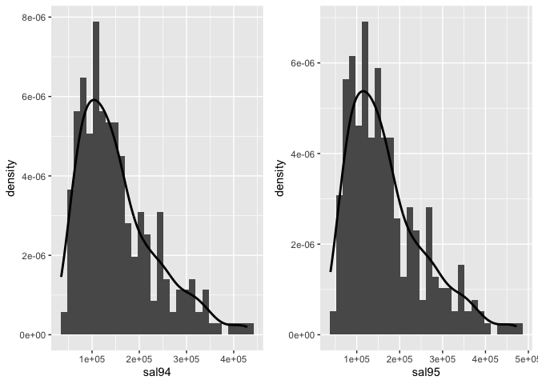
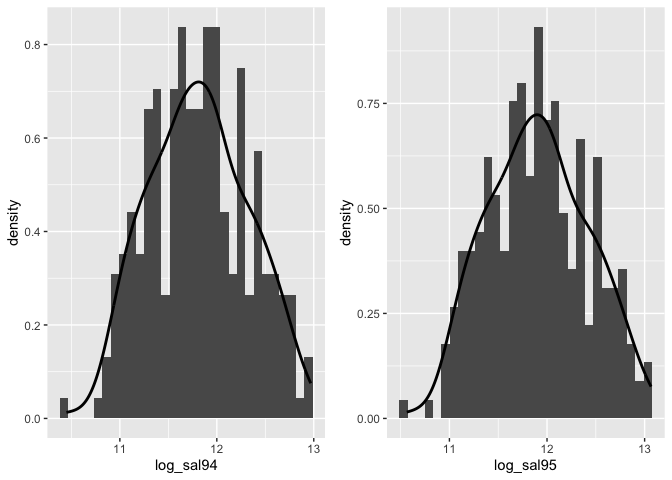

data exploration
================

``` r
lawsuit = 
read_csv("data/Lawsuit.csv") %>% 
   janitor::clean_names() %>% 
  mutate(dept = factor(dept,levels = c(1:6),
                       labels =
                    c("Biochemistry","Physiology","Genetics",
                      "Pediatrics","Medicine","Surgery")),
         gender = factor(gender,levels = c(0:1),
                       labels =
                    c("Female","Male")),
         clin = factor(clin,levels = c(0:1),
                       labels =
                    c("Research","Clinical")),
         cert = factor(cert,levels = c(0:1),
                       labels =
                    c("Not certified","Broad certified")),
         rank = factor(rank,levels = c(1:3),
                       labels =
                    c("Assistant","Associate","Full professor")))
```

    ## Parsed with column specification:
    ## cols(
    ##   ID = col_double(),
    ##   Dept = col_double(),
    ##   Gender = col_double(),
    ##   Clin = col_double(),
    ##   Cert = col_double(),
    ##   Prate = col_double(),
    ##   Exper = col_double(),
    ##   Rank = col_double(),
    ##   Sal94 = col_double(),
    ##   Sal95 = col_double()
    ## )

Summarize all variables by gender

``` r
 sum_data  <-  arsenal::tableby( gender ~ dept + clin + cert + 
                                 prate + exper + rank + sal94   +
                                 sal95, 
                                data  = lawsuit,
                                test  = FALSE, 
                                total = FALSE,
                                numeric.stats =
                                  c("meansd","medianq1q3","range"))
summ = summary(sum_data,text = TRUE)
summ
```

    ## 
    ## 
    ## |                   |           Female (N=106)           |            Male (N=155)             |
    ## |:------------------|:----------------------------------:|:-----------------------------------:|
    ## |dept               |                                    |                                     |
    ## |-  Biochemistry    |             20 (18.9%)             |             30 (19.4%)              |
    ## |-  Physiology      |             20 (18.9%)             |             20 (12.9%)              |
    ## |-  Genetics        |             11 (10.4%)             |              10 (6.5%)              |
    ## |-  Pediatrics      |             20 (18.9%)             |              10 (6.5%)              |
    ## |-  Medicine        |             30 (28.3%)             |             50 (32.3%)              |
    ## |-  Surgery         |              5 (4.7%)              |             35 (22.6%)              |
    ## |clin               |                                    |                                     |
    ## |-  Research        |             46 (43.4%)             |             55 (35.5%)              |
    ## |-  Clinical        |             60 (56.6%)             |             100 (64.5%)             |
    ## |cert               |                                    |                                     |
    ## |-  Not certified   |             36 (34.0%)             |             37 (23.9%)              |
    ## |-  Broad certified |             70 (66.0%)             |             118 (76.1%)             |
    ## |prate              |                                    |                                     |
    ## |-  Mean (SD)       |           5.350 (1.886)            |            4.646 (1.938)            |
    ## |-  Median (Q1, Q3) |        5.250 (3.725, 7.275)        |        4.000 (3.100, 6.700)         |
    ## |-  Range           |           2.400 - 8.700            |            1.300 - 8.600            |
    ## |exper              |                                    |                                     |
    ## |-  Mean (SD)       |           7.491 (4.166)            |           12.103 (6.704)            |
    ## |-  Median (Q1, Q3) |       7.000 (5.000, 10.000)        |       10.000 (7.000, 15.000)        |
    ## |-  Range           |           1.000 - 23.000           |           2.000 - 37.000            |
    ## |rank               |                                    |                                     |
    ## |-  Assistant       |             69 (65.1%)             |             43 (27.7%)              |
    ## |-  Associate       |             21 (19.8%)             |             43 (27.7%)              |
    ## |-  Full professor  |             16 (15.1%)             |             69 (44.5%)              |
    ## |sal94              |                                    |                                     |
    ## |-  Mean (SD)       |       118871.274 (56168.006)       |       177338.761 (85930.540)        |
    ## |-  Median (Q1, Q3) | 108457.000 (75774.500, 143096.000) | 155006.000 (109687.000, 231501.500) |
    ## |-  Range           |       34514.000 - 308081.000       |       52582.000 - 428876.000        |
    ## |sal95              |                                    |                                     |
    ## |-  Mean (SD)       |       130876.915 (62034.507)       |       194914.090 (94902.728)        |
    ## |-  Median (Q1, Q3) | 119135.000 (82345.250, 154170.500) | 170967.000 (119952.500, 257163.000) |
    ## |-  Range           |       38675.000 - 339664.000       |       58923.000 - 472589.000        |

Distributions

``` r
gg_94 = 
lawsuit %>% 
 ggplot(aes(sal94,..density..))+
 geom_histogram()+
 geom_line(stat = 'density',size = 1)+
    labs(x = "sal94")

gg_95 = 
lawsuit %>% 
 ggplot(aes(sal95,..density..))+
 geom_histogram()+
 geom_line(stat = 'density',size = 1)+
    labs(x = "sal95")

gg_94 + gg_95
```

    ## `stat_bin()` using `bins = 30`. Pick better value with `binwidth`.
    ## `stat_bin()` using `bins = 30`. Pick better value with `binwidth`.

<!-- -->

Possible transformation

``` r
lawsuit_log = 
lawsuit %>% 
  mutate(log_sal94 = log(sal94),
         log_sal95 = log(sal95)) %>% 
  select(-sal94,-sal95)

gg_94 = 
lawsuit_log %>% 
 ggplot(aes(log_sal94,..density..))+
 geom_histogram()+
 geom_line(stat = 'density',size = 1)+
    labs(x = "log_sal94")

gg_95 = 
lawsuit_log %>% 
 ggplot(aes(log_sal95,..density..))+
 geom_histogram()+
 geom_line(stat = 'density',size = 1)+
    labs(x = "log_sal95")

gg_94 + gg_95
```

    ## `stat_bin()` using `bins = 30`. Pick better value with `binwidth`.
    ## `stat_bin()` using `bins = 30`. Pick better value with `binwidth`.

<!-- -->
